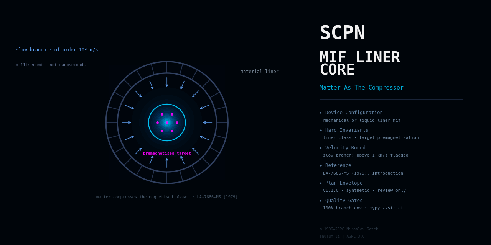

<!--
SPDX-License-Identifier: AGPL-3.0-or-later
Commercial license available
© Concepts 1996–2026 Miroslav Šotek. All rights reserved.
© Code 2020–2026 Miroslav Šotek. All rights reserved.
ORCID: 0009-0009-3560-0851
Contact: www.anulum.li | protoscience@anulum.li
SCPN MIF Liner Core — README
-->

<div align="center">
  
</div>

# SCPN MIF Liner Core

Governed device-family repository for mechanical- and liquid-liner
magnetised-target fusion systems within the SCPN Reactor Systems Research
Group. This repository is the designated owner of device-level truth for
the `mechanical_or_liquid_liner_mif` configuration of the SCPN Phase
Orchestrator reactor registry (material-liner compression).

**Evidence maturity: `computational_prototype`** (per-capability; ADR 0002).
Three capabilities are implemented: the device configuration model —
validated parameter objects with documented consistency estimates,
canonical serialisation, and a data-only SPO registry pin
(evidence: `VALIDATION.md#device-configuration-model`) — and the
diagnostic and clock semantics model — synthetic channel and clock
declarations aligned fail-closed with the pinned SPO observability
catalogue (ADR 0003, evidence:
`VALIDATION.md#diagnostic-and-clock-semantics`); and level-0 device
physics — the mechanics of the driven annular shell and what its
convergence does to the field and the plasma by flux conservation and
adiabatic compression, both recorded as upper bounds rather than
predictions, anchored on the two design points a filed Los Alamos report
prints (ADR 0005, evidence: `VALIDATION.md#level-0-device-physics`). No
parameter set, channel or number describes any real machine or
diagnostic; the claim inventory is empty and verified by the domain
validator.

## Scope

This repository owns, for the material-liner MIF device family:

- the device boundary: plant and experiment truth, shot lifecycle, and
  configuration policy for schemes compressing a magnetised target plasma
  with a material liner — mechanically driven solid pusher assemblies or
  rotating liquid-metal liners collapsed by synchronised driver systems —
  on millisecond-class timescales far slower than pulsed-power or laser
  implosions;
- liner-system semantics as device truth: liner-material and drive-class
  declarations (pneumatic/piston arrays, rotating liquid vortex),
  compression-symmetry budgets, liner–plasma interface declarations, and
  the repetition-capable plant orientation (liner recovery and re-use,
  liquid-wall heat extraction) as configuration facets;
- diagnostic semantics, reference frames, and clock identity declarations;
- actuator-response model boundaries and the declared safety envelope;
- the device-owned CONTROL adapter specification;
- the binding to the SCPN Phase Orchestrator reactor registry
  (version `1.0.0`, digest
  `786d9542ce76c56dd7748fa948b17efed6c073525e527ce90e6d5e29a2d00090`);
- the machine-readable domain manifest `reactor-domain.json` and the derived
  Studio portfolio descriptor (integration state `not_federated`).

## Explicit exclusions

- **MagLIF-class pulsed-power solid-liner implosion**:
  `SCPN-MIF-MAGLIF-CORE`.
- **Plasma-jet liners**: `SCPN-MIF-PLASMA-JET-CORE`.
- **Target-plasma physics** (for a compact-toroid target):
  `SCPN-FRC-CORE`; the pulsed FRC merge-compression workflow, trigger, and
  RTL remain with `SCPN-MIF-CORE`.
- **Solver mathematics and validation evidence**: `SCPN-FUSION-CORE` until
  an exact surface passes the reactor family migration gate; no solver code
  exists in, or was copied into, this repository.
- **Typed signal semantics and comparability**: `SCPN-PHASE-ORCHESTRATOR`
  (review-only output; never actuation).
- **Control admission and action formation**: `SCPN-CONTROL` is the sole
  software authority that forms an admitted `ControlAction`.
- **Machine protection**: independent systems retain the final veto.
- **Portfolio presentation, identity, entitlement, and execution gating**:
  `SCPN-STUDIO`.

## Non-claims

This repository is not machine-ready, not safety-certified, and not
reactor-ready. It contains no implemented solver, no controller, no
benchmark result, no experimental correlation, no dataset, and no published
artefact, and no parameter set describes or validates any real machine. Liner-material, driver-array, and fuel choices are
configuration facets, not separate claims. No capability has reached any
evidence-maturity state beyond `computational_prototype`.

## Architecture

The five-surface boundary and the position of this repository in the SCPN
ecosystem are defined in [`docs/ARCHITECTURE.md`](docs/ARCHITECTURE.md) and
fixed by
[`docs/adr/0001-repository-boundary.md`](docs/adr/0001-repository-boundary.md).
The threat model is in [`docs/THREAT_MODEL.md`](docs/THREAT_MODEL.md); the
CONTROL adapter contract is in
[`docs/CONTROL_ADAPTER_SPECIFICATION.md`](docs/CONTROL_ADAPTER_SPECIFICATION.md).

## Validation

Every gate currently active in this repository is listed in
[`VALIDATION.md`](VALIDATION.md). The local sequence is:

```bash
make lint        # ruff check + ruff format --check
make typecheck   # mypy --strict tools tests
make test        # pytest with 100 % statement and branch coverage on tools/
make validate    # domain manifest, descriptor, and inventory checks
make preflight   # the full fail-closed gate sequence
```

## Security

See [`SECURITY.md`](SECURITY.md) for the supported states and the private
reporting route (protoscience@anulum.li).

## Licensing

AGPL-3.0-or-later for the public repository, with a commercial licence
available (see [`NOTICE.md`](NOTICE.md)). Licence texts are under
[`LICENSES/`](LICENSES/); machine-readable licensing metadata follows
REUSE 3.x (`REUSE.toml`).

## Citation

Citation metadata is provided in [`CITATION.cff`](CITATION.cff). No release,
version, or DOI exists yet; cite the repository state you inspected.
